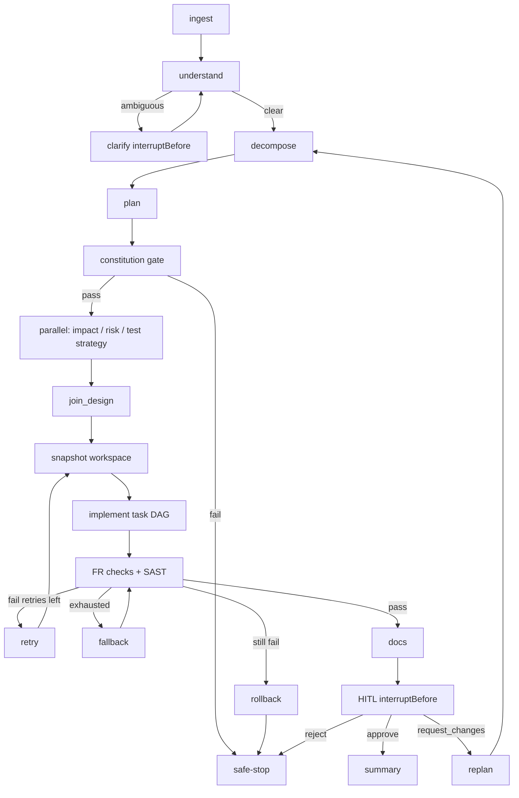

# Architecture — LangGraph4j SDLC

LangGraph4j `StateGraph<OrchestratorState>` is the control plane. The URL shortener (`com.example.shortener`) is the data plane.

Checkpoints: `MemorySaver` + `threadId`. Resume: `GraphInput.resume(updates)`.
